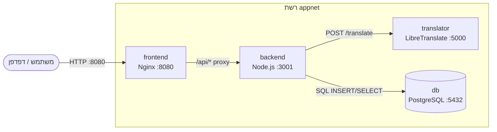

# דיאגרמת Docker Compose



## הסבר

- **frontend** – מגיש קבצים סטטיים ומפנה בקשות API ל-backend (בסביבת Compose בלבד).
- **backend** – מקבל בקשות תרגום, פונה ל-translator, שומר היסטוריה ב-DB.
- **translator** – מבצע את התרגום בפועל (LibreTranslate).
- **db** – שומר טבלת `translations` עם `source_text`, `target_lang`, `translated_text`.

## פקודות בדיקה

```bash
docker compose build
docker compose up -d
curl -X POST http://localhost:3001/translate \
  -H "Content-Type: application/json" \
  -d '{"text":"hello","target":"he"}'
```
