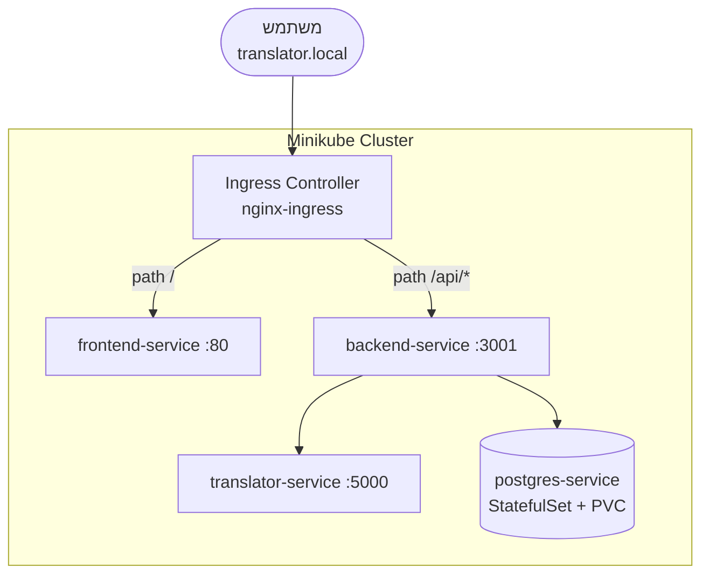

# דיאגרמת Kubernetes + Ingress



## ניתוב Ingress

| Path | שירות | פורט |
|------|--------|------|
| `/` | frontend-service | 80 |
| `/api/*` | backend-service | 3001 |

Annotation `rewrite-target: /$2` מסיר את הקידומת `/api` לפני שליחה ל-backend.

## Health Probes (Backend)

- **Liveness** – `/health` – האם הקונטיינר חי?
- **Readiness** – `/ready` – האם מוכן לקבל תעבורה?

## פקודות

```bash
minikube addons enable ingress
kubectl apply -f k8s/
echo "$(minikube ip) translator.local" | sudo tee -a /etc/hosts
curl http://translator.local/api/history
```
