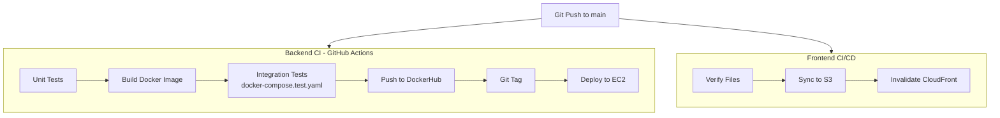

# דיאגרמת CI/CD

## Secrets נדרשים ב-GitHub

| Secret | שימוש |
|--------|--------|
| `DOCKERHUB_USERNAME` | Push images |
| `DOCKERHUB_TOKEN` | Push images |
| `AWS_ROLE_ARN` | OIDC ל-AWS |
| `AWS_REGION` | אזור |
| `S3_BUCKET_NAME` | Frontend bucket |
| `CLOUDFRONT_DISTRIBUTION_ID` | Cache invalidation |
| `EC2_HOST` / `EC2_SSH_KEY` | Deploy backend |

## עקרונות

- פריסה רק אחרי שכל הבדיקות עברו
- OIDC במקום Access Keys קבועים
- תיוג אוטומטי לפי commit SHA
