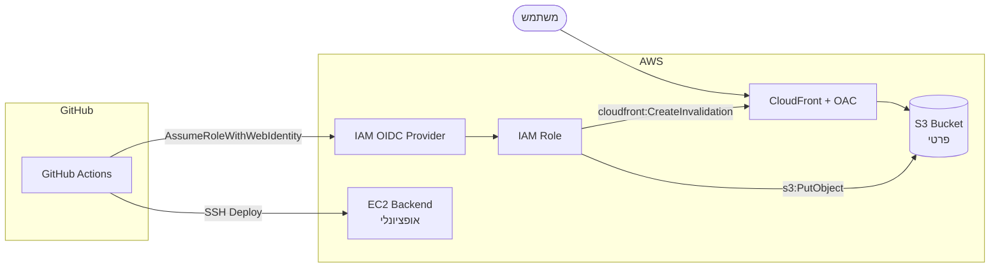

# דיאגרמת AWS + Terraform



## מה Terraform יוצר

| משאב | תפקיד |
|------|--------|
| `aws_s3_bucket` | אחסון קבצי frontend |
| `aws_cloudfront_distribution` | CDN + caching |
| `aws_cloudfront_origin_access_control` | S3 פרטי, גישה רק מ-CloudFront |
| `aws_iam_openid_connect_provider` | חיבור GitHub ↔ AWS |
| `aws_iam_role` | הרשאות ל-GitHub Actions |
| `aws_instance` | EC2 ל-backend (אם הוגדר key) |

## למה OAC?

במקום S3 ציבורי – רק CloudFront יכול לקרוא מה-bucket. זה Best Practice לאבטחה.

## שימוש

```bash
cd terraform
terraform init
terraform apply
```

Outputs חשובים:
- `github_actions_role_arn` → `AWS_ROLE_ARN` secret
- `cloudfront_distribution_id` → `CLOUDFRONT_DISTRIBUTION_ID` secret
- `s3_bucket_name` → `S3_BUCKET_NAME` secret
