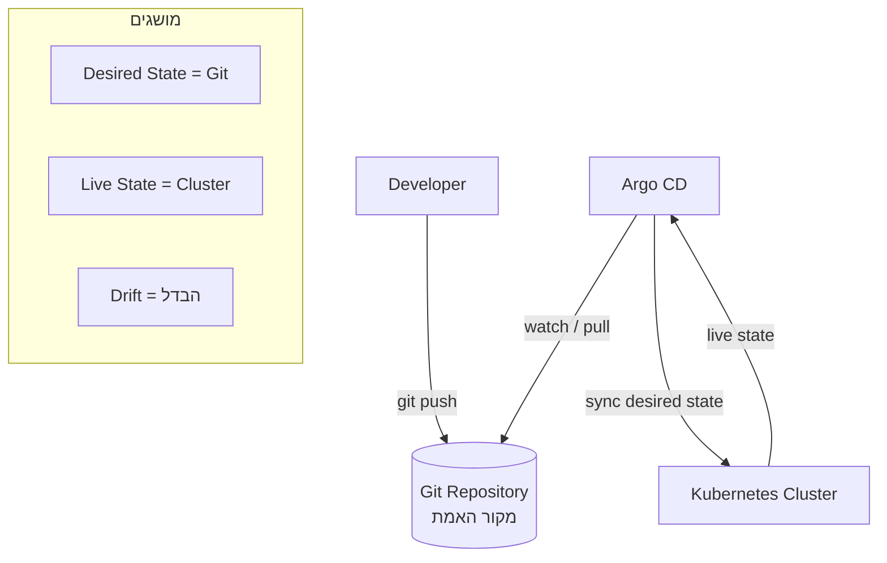

# Argo CD ו-GitOps



## מה זה GitOps?

**Git הוא מקור האמת.** כל מה שרץ ב-Kubernetes חייב להיות מוגדר ב-Git.
אם מישהו משנה ידנית ב-Cluster – Argo CD מזהה **Drift** ומתקן (עם `selfHeal: true`).

## Argo CD מול Jenkins

| | Jenkins | Argo CD |
|---|---------|---------|
| תפקיד עיקרי | CI / Pipelines | GitOps / CD |
| מודל | Push deployment | Pull deployment |
| Kubernetes Native | פחות | כן |

## Application שלנו

קובץ: `argocd/application.yaml`

- **Source:** `HelmChartPostgress/my-app/app-translator`
- **Sync Policy:** automated + prune + selfHeal
- **Helm values:** `values.yaml`

## התקנה

```bash
kubectl create namespace argocd
kubectl apply -n argocd -f \
  https://raw.githubusercontent.com/argoproj/argo-cd/stable/manifests/install.yaml

# עדכני repoURL ב-application.yaml לריפו שלך
kubectl apply -f argocd/application.yaml

# גישה ל-UI
kubectl port-forward svc/argocd-server -n argocd 8080:443
```

## Rollback

```bash
# ב-Git – חזרה ל-commit קודם
git revert <commit>
git push

# Argo CD מסנכרן אוטומטית
# או ידנית:
argocd app sync app-translator
```

## קשר לפרויקט

Argo CD משלים את ה-CI/CD:
- **GitHub Actions** – בונה images, מעלה ל-S3/DockerHub
- **Argo CD** – מפריס ומנהל את ה-Helm chart ב-Kubernetes
