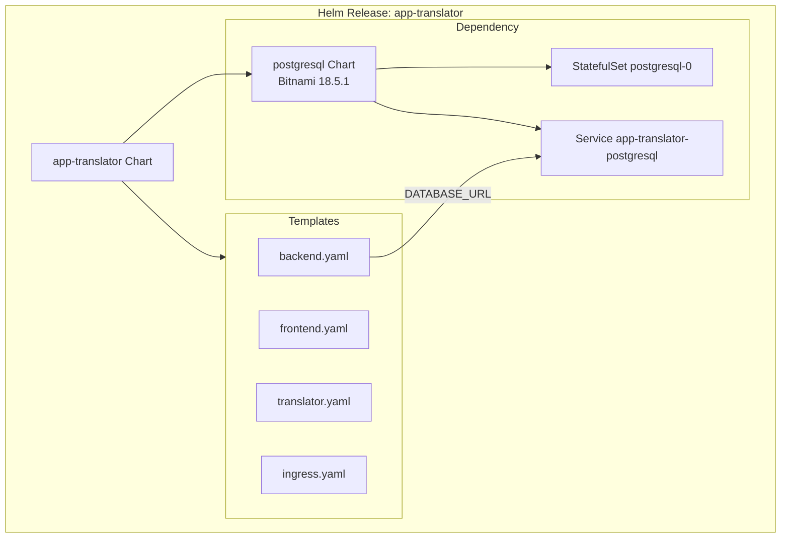

# דיאגרמת Helm + PostgreSQL (Bitnami)



## לפני ואחרי

| | StatefulSet ידני | Bitnami Helm |
|---|------------------|--------------|
| קוד | ~90 שורות YAML | הגדרה ב-values.yaml |
| תחזוקה | ידנית | `helm upgrade` |
| Rollback | קשה | `helm rollback` |
| Init SQL | ConfigMap | `postgresql.primary.initdb.scripts` |

## DATABASE_URL דינמי

```
postgres://{{ user }}:{{ password }}@{{ .Release.Name }}-postgresql:5432/{{ database }}
```

שם ה-Service נגזר משם ה-release (`app-translator-postgresql`).

## בעיות נפוצות

1. **הטבלה לא קיימת** – PVC ישן. פתרון: `helm uninstall` + `kubectl delete pvc --all`
2. **502 Bad Gateway** – בדקי `DATABASE_URL` ב-logs של backend
3. **Chart.lock חסר** – הריצי `helm dependency update`
